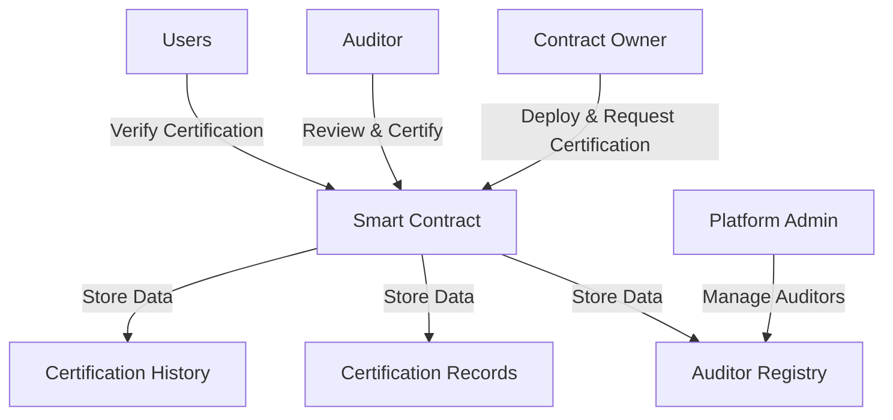

# HashEssential Factory

A robust, decentralized smart contract certification and verification ecosystem that transforms blockchain trust through comprehensive auditing and transparent verification mechanisms.

## Overview

ChainTrust provides a robust framework for:
- Certifying smart contracts through qualified auditors
- Managing auditor registrations and reputations
- Tracking certification history
- Enabling easy contract verification
- Creating transparent audit trails

The platform bridges the trust gap between contract developers and users by providing verifiable certifications from reputable auditors.

## Architecture



### Core Components
- **Auditor Registry**: Manages approved auditors and their credentials
- **Certification System**: Handles certification requests and issuance
- **Verification Engine**: Provides public verification endpoints
- **History Tracking**: Maintains immutable certification records

## Contract Documentation

### chain-trust.clar

The main contract managing the entire certification platform.

#### Key Features
- Auditor registration and management
- Certification request handling
- Certificate issuance and verification
- History tracking
- Reputation management

#### Access Control
- Contract Owner: Platform administration
- Auditors: Certification issuance
- Public: Verification queries
- Contract Owners: Certification requests

## Getting Started

### Prerequisites
- Clarinet
- Stacks wallet
- Access to Stacks blockchain

### Basic Usage

1. **Request Certification**
```clarity
(contract-call? 
  .chain-trust 
  request-certification 
  contract-principal 
  "1.0.0" 
  "Contract description" 
  "https://github.com/repo")
```

2. **Verify Contract**
```clarity
(contract-call? 
  .chain-trust 
  verify-contract 
  contract-principal 
  "1.0.0")
```

## Function Reference

### Public Functions

#### Auditor Management
```clarity
(apply-as-auditor name company website credentials)
(approve-auditor auditor)
(update-auditor-status auditor new-status)
```

#### Certification
```clarity
(request-certification contract-id version description repository-url)
(issue-certification contract-id version security-rating audit-report-url valid-until notes)
(revoke-certification contract-id version)
```

#### Verification
```clarity
(verify-contract contract-id version)
(get-verification-info contract-id version)
```

## Development

### Testing
1. Set up local Clarinet environment
```bash
clarinet new
```

2. Deploy contracts
```bash
clarinet console
```

3. Run test scenarios
```clarity
;; Test auditor registration
(contract-call? .chain-trust apply-as-auditor "Auditor Name" "Company" "website" "credentials")
```

### Local Setup
1. Clone repository
2. Install dependencies
3. Configure Clarinet
4. Deploy contracts

## Security Considerations

### Best Practices
- Always verify contract certification before interaction
- Check auditor reputation scores
- Verify certification expiration dates
- Use the detailed verification info endpoint for complete status

### Limitations
- Certifications are time-bound
- Auditor reputation can change
- Certification doesn't guarantee zero vulnerabilities
- Platform depends on auditor quality

### Risk Mitigation
- Multiple auditor reviews recommended
- Regular recertification for critical contracts
- Monitor auditor reputation changes
- Check certification history for patterns